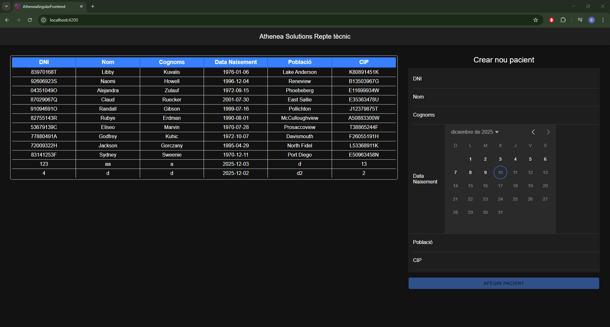
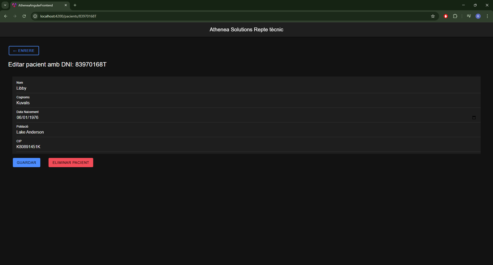

# 🌟 Athenea Solutions - Prova tècnica

Aquest repositori conté el codi d'una prova tècnica estructurada en dues parts: un backend basat en Laravel (PHP) i un frontend basat en Angular (Node.js/npm).

## 📝 Resum del Repte Enunciat

L'objectiu principal del repte era crear una aplicació web full stack per a la **gestió d'un llistat de pacients**.

### Funcionalitats Requerides
* **Llistat:** Mostrar els pacients en format de taula.
* **Perfil/Edició:** En clicar sobre un pacient, s'ha de mostrar el perfil amb les seves dades, que han de ser editables.
* **Creació:** Formulari per afegir un nou pacient.

### Camps dels Pacients
* Nom
* Cognoms
* Data de Naixement (`dataNaixement`)
* DNI
* Població
* CIP

---
## 💡 Decisions Tècniques Preses

### 1. Elecció del Backend: Laravel i SQLite

* **Framework (Laravel):** He seleccionat **Laravel (PHP)** com a *backend* principal. Aquesta decisió es basa en la meva experiència i comoditat amb el *framework*, cosa que em permet una implementació ràpida i robusta dels *endpoints* de l'API REST per a la gestió dels pacients (CRUD).
* **Base de Dades (SQLite):** He optat per **SQLite** com a base de dades. Donat que el repte només requeria la gestió d'una única taula de pacients amb un CRUD bàsic, vaig considerar que una base de dades més complexa com MySQL o PostgreSQL no era necessària.

### 2. Elecció del Frontend: Angular amb Ionic

* **Angular (Frontend):** He utilitzat el *framework* **Angular** per a la part client.
* **Aportació de Valor amb Ionic:** Tot i la meva falta d'experiència prèvia específica amb Angular i Ionic, he decidit integrar el *framework* **Ionic** en la capa de presentació. Aquesta decisió l'he presa intencionadament ja que, considerant que Ionic és una tecnologia d'ús freqüent en aquesta empresa, he volgut alinear la solució a les vostres eines.

---

## ⚠️ AVISOS IMPORTANTS (Mode d'Execució Manual)

* **Actualment, l'execució directa amb Docker Compose no funciona.**
* Per tant, caldrà executar els serveis de *frontend* i *backend* **manualment** (amb `php artisan serve` i `npm start`) un cop s'hagi fet la configuració inicial.

---
## 📸 Captures de Pantalla del Resultat

Així és com es veu la pàgina web un cop els dos serveis s'estan executant correctament:

### Primera Vista (Llistat de Pacients)

### Segona Vista (Detalls del Pacient)

---

## 🌐 Informació Addicional

Un cop aixecats els serveis manualment, estaran accessibles a les següents adreces:

| Servei | URL |
| :--- | :--- |
| **Backend (Laravel)** | `http://localhost:8000` |
| **Frontend (Angular)** | `http://localhost:4200` |
